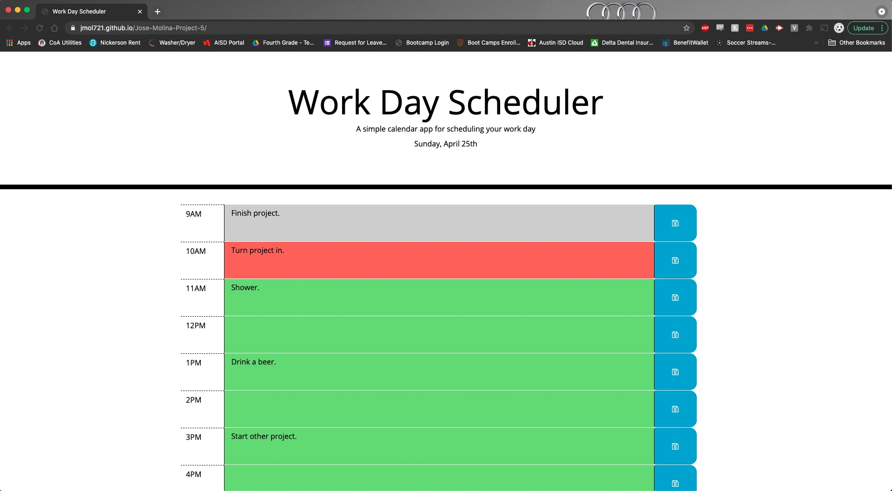
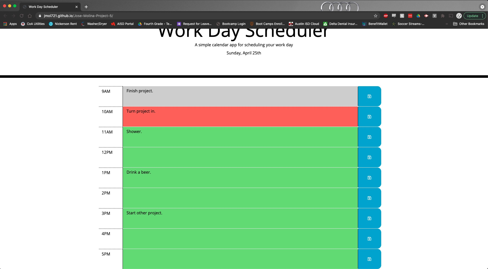

# Jose-Molina-Project-5

This is a scheduler app that helps plan out your daily routine. It will display the currect date and color-code time blocks to show past, present, and future times. Events will be stored in local storage to ensure they persist on the page even after refreshing.

Repo Url:
https://github.com/jmol721/Jose-Molina-Project-5

Deployed App Url:
https://jmol721.github.io/Jose-Molina-Project-5/

Screenshots:

